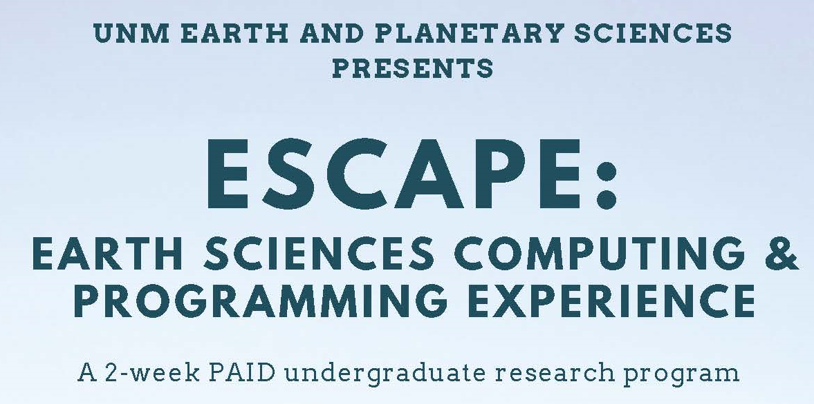

#

## About
ESCAPE 2022 is a 2-week program designed to introduce participants to scientific
computing, Earth science and spatial data analysis in a fun, inclusive, collaborative environment.

## Schedule

### Week 1

#### Day 1: Introduction to programming
  * 9:30 – 11: Introduction to the course and icebreaker
  * 11:15 – 12: Lecture: **Intro to programming (Eric)**
  * 12 – 1: Lunch – Pizza
  * 1 – 2: Jupyter and python installation and demo
  * 2 – 4: Self-guided exercises: intro to Python notebook

#### Day 2: Interacting with data
  * 9:30 – 10:15: Lecture: **Satellites, GPS, and modern geodesy (Eric)**
  * 10:30 – 12: Lecture / demo: **getting GPS data and making a plot (Jeng Hann)**
  * 12 – 1: Lunch – Panera
  * 1 - 2: Lecture: **Modeling and parameter estimation (Eric)**
  * 2 – 4: Self-guided exercises: reading GPS data, plotting, and line-fitting

#### Day 3: Maps and spatial data
  * 9:30 – 11:30: Lecture: **Questions in Plate tectonics and the western US (Mousumi)**
  * 11:30 – 12: **Maps and cartopy demo (Jeng Hann)**
  * 12 – 1: Lunch – Jimmy John's
  * 1 – 4: Self-guided exercises: cartopy installation, introduction and mapping GPS vectors

#### Day 4: More advanced modeling
  * 9:30 – 10:30: Lecture: **InSAR and Geodetic modeling (Eric)**
  * 10:45 – 12: Geodesy modeling demo – visible earthquakes website, Okada model
  * 12 – 1: Lunch – Sahara
  * 1 – 2: Lecture: **Alaskan tectonics (Lindsay)**
  * 2 – 3: CARC office hours
  * 3 – 3:30: Lecture: **ABQ geology (Lindsay)**
  * 2:30 – 4: Self-guided exercises: modeling and mapping

#### Day 5: Field trip all day
  * Volcanoes
  * Lunch - on the road
  * Foothills

###  Week 2

#### Day 6: Seismology
  * 9:30 – 10:30: **What is seismology? (Brandon)**
  * 11 – 12: Lecture: **ObsPy intro & demo (Evans)**
  * 12 - 1: Lunch – w/grad students
  * 1 – 3 ObsPy demo & exercises
  * 3 – 4: Lecture: **Prep for active seismic survey (Lindsay)**

#### Day 7:
  * 8:30 – 12: Seismic survey at Alameda open space
  * Lunch – w/grad students
  * 1-3: CARC visit and HPC introduction

#### Day 8: Seismology and group projects
  * 9:30 - 10:30 Lecture: **Seismic reflection (Lindsay)**
  * 11 - 12: **Plotting seismic reflection data and picking arrivals demo (Evans)**
  * Lunch – w/grad students
  * Start work on group projects

#### Day 9: Group projects
  * Group projects all day

#### Day 10: Last day!
  * 9:30 – 11: **Group presentations**
  * 11:15 – 12: Lecture: **Going to grad school, careers in geophysics**
  * 12pm onward: Join grad students for lunch on the lawn and ice cream social

## Installation
Programming will be done within the Jupyter-Lab environment. This can be installed through conda (https://www.anaconda.com/).

To ensure your conda environment has all the packages needed for this course:
1) Download the environment.yml file
2) conda env create -f environment.yml

## Contributors
Eric Lindsey, Evans Onyango, Jeng Hann Chong, Lindsay Worthington, Mousumi Roy, Brandon Schmandt

## Maintainers
Eric Lindsey, Evans Onyango

## Acknowledgements
Thanks to NSF support for making this program possible (Award #2146272).
